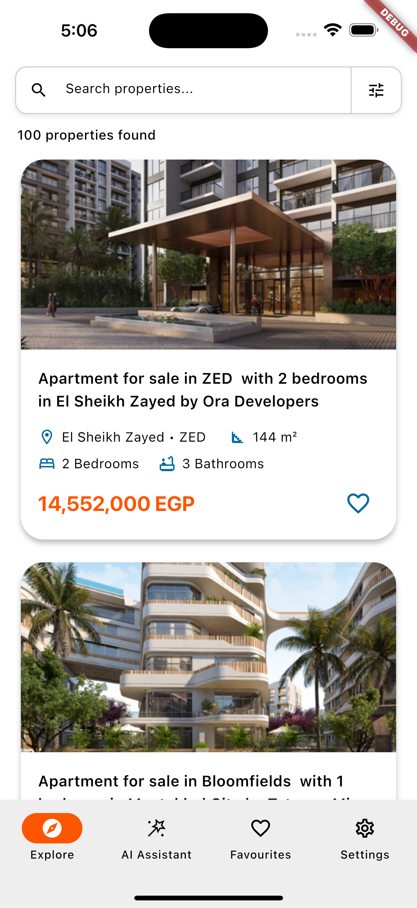
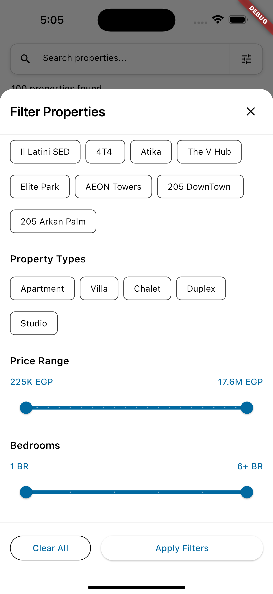

<div align="center">
  <table>
    <tr>
      <td>
        
      </td>
      <td>
        <div>
          
          
          
          
          <br><br>
          
          
          
          
          
          <br><br>
          
          
          
        </div>
      </td>
    </tr>
  </table>
</div>

# Nawy App - AI-Powered Real Estate Search

Real estate property search application built with **Flutter**. Features AI-powered search, advanced filtering, and favorites functionality with modern mobile UX.

---

## ✨ Features

- **🤖 AI Property Assistant** – Ask in plain language:  
  “Find me a 3-bedroom villa in New Cairo under 5M EGP”
- **🔍 Smart Search** – Real-time text search across properties, areas, and compounds
- **⚡ Advanced Filtering** – Filter by area, compound, price, bedrooms, and property type
- **❤️ Favorites** – Save properties locally for offline access
- **📱 Modern UI** – Clean, responsive design following Flutter best practices

---

## 📱 Screenshots

<div align="center">
  <table>
    <tr>
      <td align="center">
        
        <br>
        <strong>Property Search & Results</strong>
      </td>
      <td align="center">
        
        <br>
        <strong>Advanced Filtering Options</strong>
      </td>
    </tr>
  </table>
</div>

---

## 🏗️ Architecture

Built with modern Flutter practices and feature-first folder structure:

- **Feature-first approach**: Each feature is isolated in its own module  
- **State Management**: BLoC pattern with improved state management architecture
- **Local Storage**: ObjectBox database for favorites only (properties and compounds)
- **Networking**: Dio for HTTP requests with interceptors
- **Dependency Injection**: get_it with injectable for code generation
- **Logging**: Professional logging framework with AppLogger service

### Tech Stack
- **Framework**: Flutter with Dart
- **State Management**: flutter_bloc + bloc_test
- **Local Database**: ObjectBox (for favorites only)
- **Networking**: Dio with interceptors
- **Serialization**: json_annotation + build_runner
- **Dependency Injection**: get_it + injectable (code generation)
- **Testing**: mocktail + bloc_test for comprehensive testing
- **Logging**: logger package with production-safe implementation

### Model Architecture
Each entity follows a three-layer model pattern:
- **Domain Entity** (e.g., `Property`) - Pure business logic
- **DTO** (e.g., `PropertyDto`) - API serialization/deserialization  
- **ObjectBox** (e.g., `PropertyObx`) - Local database persistence (favorites only)  

---

## 📁 Project Structure

```
lib/
├── main.dart               # Application entry point
├── app/
│   ├── core/               # Shared core functionality
│   │   ├── constants/      # App-wide constants
│   │   ├── utils/          # Utility functions & extensions
│   │   ├── widgets/        # Shared, reusable widgets
│   │   └── common/         # Shared types (e.g., Status<T>)
│   ├── features/           # Application features (modular)
│   │   ├── search/         # Property search feature
│   │   ├── favorites/      # Favorites management
│   │   ├── ai_chat/        # AI assistant
│   │   └── [feature]/      # Each feature module
│   │       ├── domain/     # Business logic (entities, repositories)
│   │       ├── data/       # Data layer (sources + models)
│   │       │   ├── remote/ # API sources and DTOs
│   │       │   └── local/  # Local sources and ObjectBox entities
│   │       └── presentation/ # UI layer (bloc/pages/widgets)
│   └── widgets/            # Shared widgets
```

---

## 🚀 Quick Start

```bash
# Install dependencies
flutter pub get

# Generate code
dart run build_runner build --delete-conflicting-outputs

# Run the app
flutter run
```

---

## 🧪 Testing

Comprehensive test suite with **187 automated tests** achieving **100% pass rate**:

### Test Architecture
- **Unit Tests**: Core utilities (DioClient, AppLogger, ObxService)
- **DTO Tests**: JSON serialization/deserialization for all models
- **Integration Tests**: API client integration with mocking
- **Repository Tests**: Domain layer business logic
- **BLoC Tests**: Business logic with bloc_test (17 tests)
- **API Contract Tests**: Live endpoint validation

### Test Coverage Breakdown
- **Core Utils**: 58 tests (DioClient + AppLogger + ObxService)
- **DTO Models**: 60 tests (Property, Compound, FilterOptions, Area)
- **Remote Sources**: 13 tests (API integration + text search functionality)
- **Domain Layer**: 12 tests (Repository pattern)
- **BLoC Layer**: 17 tests (SearchBloc business logic with bloc_test)
- **API Contract**: 12 tests (Live endpoint validation)
- **Text Search**: Comprehensive testing of search functionality

```bash
# Run all tests
flutter test

# Run specific test file
flutter test test/core/utils/dio_client_test.dart

# Run with coverage
flutter test --coverage

# Run tests with verbose output
flutter test --reporter=expanded
```

---

## 🤖 AI Assistant

Powered by **Firebase AI Logic** and **Gemini 2.5 Pro** with tool calling:

- Natural language property queries  
- Contextual understanding and memory  
- Conversational interface via `flutter_chat_ui`  

**Example queries:**
- "Show me luxury apartments in Bloomfields"
- "Find villas under 4M EGP with 4+ bedrooms"
- "What's available in New Cairo?"

---

## 🔍 Text Search Implementation

Comprehensive text search functionality allows users to find properties by typing search terms:

### Search Capabilities
- **Property Names**: Search within property titles (e.g., "Luxury Apartment", "Modern Villa")
- **Area Names**: Search by location names (e.g., "El Sheikh Zayed", "New Cairo")
- **Compound Names**: Search by development names (e.g., "ZED West", "Bloomfields")

### Search Features
- **Case-Insensitive**: "VILLA" and "villa" return identical results
- **Partial Matching**: "zayed" matches "El Sheikh Zayed"
- **Real-time Filtering**: Results update as you type with 500ms debounce
- **Combined Search**: Text search works alongside area, price, and bedroom filters
- **Smart Query Handling**: Empty/whitespace queries return all properties

---

## 📊 Data Strategy

- **Online-first**: Live property data via API  
- **Favorites-only offline support**: ObjectBox for saved properties  
- **Client-side filtering**: Ensures realistic functionality even with static API responses  
- **Future-proof**: Network integration preserved for when real endpoints are ready  

---

## ⚠️ API Implementation Note

**Important**: The provided API endpoints don't function as expected for a proper search application, which required implementing a workaround:

### API Limitations Discovered
- **Properties Search**: Always returns the same 12 static properties regardless of any search filters
- **No Server-Side Filtering**: All query parameters (area_ids, compound_ids, price ranges, bedrooms, etc.) are completely ignored
- **Static JSON Files**: The API serves static JSON files instead of dynamic server responses
- **No Pagination**: No server-side pagination functionality is implemented

### Workaround Implementation
To demonstrate proper search and filtering functionality that would work with a real API:

- **Local Data Source**: Created `properties.json` with 100+ realistic properties matching the exact API response structure
- **Client-Side Filtering**: Implemented comprehensive search and filtering logic in `PropertyRemoteSource`
- **Preserved Network Code**: All original API integration code is preserved and commented out with detailed explanations
- **Production Ready**: The architecture is ready to switch back to network calls when a properly functioning API is available

### Files Modified for Workaround
- `lib/app/features/search/data/sources/remote/property_remote_source.dart` - Contains both commented network implementation and working local implementation
- `properties.json` - 100+ properties in exact API format for demonstration
- All original network integration code is preserved and can be easily restored

This approach demonstrates both proper API integration patterns and functional search/filtering capabilities that would work with a real backend API.  
