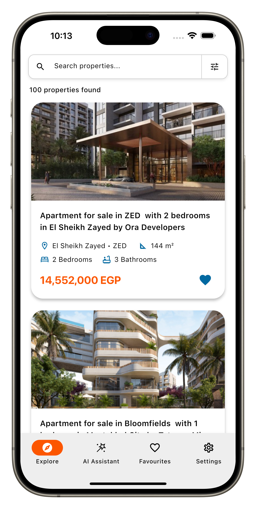
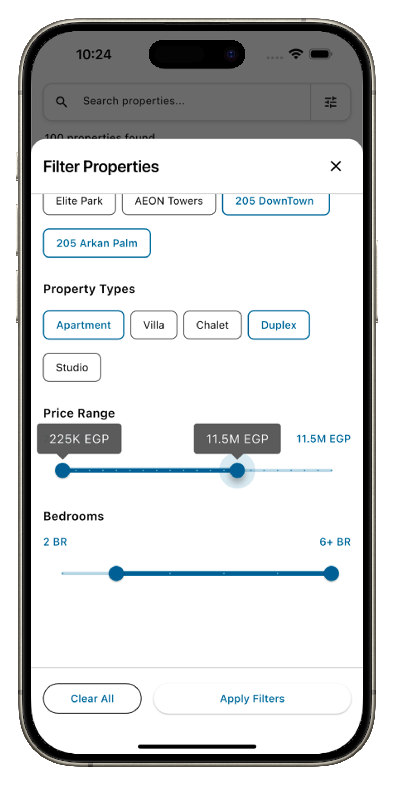
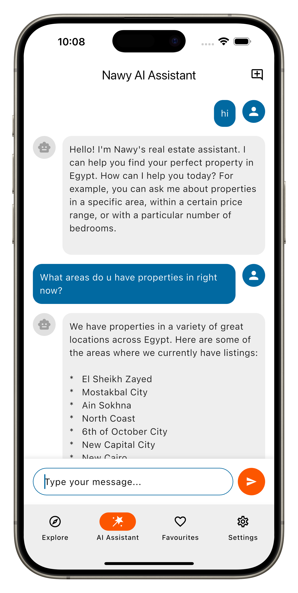

<div align="center">
  <table>
    <tr>
      <td>
        
      </td>
      <td>
        <div>
          
          
          
          
          <br><br>
          
          
          
          
          
          <br><br>
          
          
          
        </div>
      </td>
    </tr>
  </table>
</div>

# Nawy App - AI-Powered Real Estate Search

🤖 AI-powered real estate search app built with Flutter & Firebase AI. Features natural language property search using Gemini 2.5 Pro, advanced filtering, favorites, and responsive web deployment. Built with Clean Architecture, BLoC pattern, and comprehensive testing.

## 🚀 Live Demo
**[Try the app live →](https://isl270.github.io/nawy-ai-flutter-app/)**

---

## ✨ Features

- **🤖 AI Property Assistant** – Natural language property search powered by Firebase AI & Gemini 2.5 Pro:  
  - "Find me a 3-bedroom villa in New Cairo under 5M EGP"
- **🔧 Function Calling** – AI can intelligently call property search functions with proper parameters
- **💬 Custom Chat UI** – Beautiful chat interface with message bubbles, loading states, and auto-scrolling
- **🔍 Smart Search** – Real-time text search across properties, areas, and compounds
- **⚡ Advanced Filtering** – Filter by area, compound, price, bedrooms, and property type
- **❤️ Favorites** – Save properties locally for offline access
- **📱 Modern UI** – Clean, responsive design with iPhone frame simulation on web
- **🌐 Web Compatible** – Full web deployment with responsive wrapper for desktop/mobile

---

## 📱 Screenshots

<div align="center">
  <table>
    <tr>
      <td align="center">
        
        <br>
        <strong>Property Search & Results</strong>
      </td>
      <td align="center">
        
        <br>
        <strong>Advanced Filtering Options</strong>
      </td>
      <td align="center">
        
        <br>
        <strong>AI-Powered Assistant</strong>
      </td>
    </tr>
  </table>
</div>

---

## 🏗️ Architecture

Built with modern Flutter practices and feature-first folder structure:

- **Feature-first approach**: Each feature is isolated in its own module  
- **State Management**: BLoC pattern with improved state management architecture
- **Local Storage**: Hive CE database for favorites only (properties and compounds)
- **Networking**: Dio for HTTP requests with interceptors
- **Dependency Injection**: get_it with injectable for code generation
- **Logging**: Professional logging framework with AppLogger service

### Tech Stack
- **Framework**: Flutter with Dart
- **State Management**: flutter_bloc + bloc_test
- **Local Database**: Hive CE (for favorites only) - **Web Compatible**
- **Networking**: Dio with interceptors
- **Serialization**: json_annotation + build_runner
- **Dependency Injection**: get_it + injectable (code generation)
- **Testing**: mocktail + bloc_test for comprehensive testing
- **Logging**: logger package with production-safe implementation

### 🔄 Database Migration: ObjectBox → Hive CE

Migrated from ObjectBox to **Hive CE** for full web platform support, enabling Firebase AI integration deployment without requiring reviewers to set up their own Firebase projects.

**Key Benefits:**
- ✅ Full web compatibility via IndexedDB
- ✅ Cross-platform support (mobile/desktop/web)
- ✅ Seamless Firebase AI integration on web

---

## 📁 Project Structure

```
lib/
├── main.dart               # Application entry point
├── app/
│   ├── core/               # Shared core functionality
│   │   ├── constants/      # App-wide constants
│   │   ├── utils/          # Utility functions & extensions
│   │   ├── widgets/        # Shared, reusable widgets
│   │   └── common/         # Shared types (e.g., Status<T>)
│   ├── features/           # Application features (modular)
│   │   ├── property_search/ # Property search feature
│   │   ├── favorites/      # Favorites management
│   │   ├── ai_assistant/   # AI assistant with Firebase AI
│   │   └── [feature]/      # Each feature module
│   │       ├── domain/     # Business logic (entities, repositories)
│   │       ├── data/       # Data layer (sources + models)
│   │       │   ├── remote/ # API sources and DTOs
│   │       │   └── local/  # Local sources and Hive entities
│   │       └── presentation/ # UI layer (bloc/pages/widgets)
│   └── widgets/            # Shared widgets
```

---

## 🚀 Quick Start

```bash
# Install dependencies
flutter pub get

# Generate code
dart run build_runner build --delete-conflicting-outputs

# Run the app
flutter run
```

---

## 🧪 Testing

Comprehensive test suite with **187 automated tests** achieving **100% pass rate**:

### Test Architecture
- **Unit Tests**: Core utilities (DioClient, AppLogger, HiveService)
- **DTO Tests**: JSON serialization/deserialization for all models
- **Integration Tests**: API client integration with mocking
- **Repository Tests**: Domain layer business logic
- **BLoC Tests**: Business logic with bloc_test (17 tests)
- **API Contract Tests**: Live endpoint validation

### Test Coverage Breakdown
- **Core Utils**: 58 tests (DioClient + AppLogger + HiveService)
- **DTO Models**: 60 tests (Property, Compound, FilterOptions, Area)
- **Remote Sources**: 13 tests (API integration + text search functionality)
- **Domain Layer**: 12 tests (Repository pattern)
- **BLoC Layer**: 17 tests (PropertySearchBloc business logic with bloc_test)
- **API Contract**: 12 tests (Live endpoint validation)
- **Text Search**: Comprehensive testing of search functionality

```bash
# Run all tests
flutter test

# Run specific test file
flutter test test/core/utils/dio_client_test.dart

# Run with coverage
flutter test --coverage

# Run tests with verbose output
flutter test --reporter=expanded
```

---

## 🤖 AI Assistant

**✅ FULLY IMPLEMENTED** - Powered by **Firebase AI** and **Gemini 2.5 Pro** with function calling:

### Core Features
- **🧠 Natural Language Processing**: Ask questions in plain English
- **🔧 Function Calling**: AI intelligently calls property search functions
- **💬 Custom Chat UI**: Beautiful message bubbles with loading states and auto-scrolling
- **🎯 Contextual Responses**: AI understands property search context and provides relevant results
- **⚡ Real-time Interaction**: Instant responses with proper error handling

---

## 🔍 Text Search Implementation

Comprehensive text search functionality allows users to find properties by typing search terms:

### Search Capabilities
- **Property Names**: Search within property titles (e.g., "Luxury Apartment", "Modern Villa")
- **Area Names**: Search by location names (e.g., "El Sheikh Zayed", "New Cairo")
- **Compound Names**: Search by development names (e.g., "ZED West", "Bloomfields")

### Search Features
- **Case-Insensitive**: "VILLA" and "villa" return identical results
- **Partial Matching**: "zayed" matches "El Sheikh Zayed"
- **Real-time Filtering**: Results update as you type with 500ms debounce
- **Combined Search**: Text search works alongside area, price, and bedroom filters
- **Smart Query Handling**: Empty/whitespace queries return all properties

---

### API Limitations Discovered
- **Properties Search**: Always returns the same 12 static properties regardless of any search filters
- **No Server-Side Filtering**: All query parameters (area_ids, compound_ids, price ranges, bedrooms, etc.) are completely ignored
- **Static JSON Files**: The API serves static JSON files instead of dynamic server responses
- **No Pagination**: No server-side pagination functionality is implemented

### Workaround Implementation
To demonstrate proper search and filtering functionality that would work with a real API:

- **Local Data Source**: Created `properties.json` with 100+ realistic properties matching the exact API response structure
- **Client-Side Filtering**: Implemented comprehensive search and filtering logic in `PropertyRemoteSource`
- **Preserved Network Code**: All original API integration code is preserved and commented out with detailed explanations
- **Production Ready**: The architecture is ready to switch back to network calls when a properly functioning API is available

### Files Modified for Workaround
- `lib/app/features/property_search/data/sources/remote/property_remote_source.dart` - Contains both commented network implementation and working local implementation
- `properties.json` - 100+ properties in exact API format for demonstration
- All original network integration code is preserved and can be easily restored

This approach demonstrates both proper API integration patterns and functional search/filtering capabilities that would work with a real backend API.  